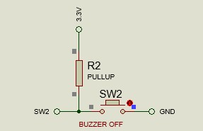

# 💊 USER CONFIGURABLE MEDICATION REMINDER SYSTEM  
### ⏰ Embedded System using LPC2148 (ARM7)

---

## ✨ Overview  

The **User Configurable Medication Reminder System** is an embedded solution developed using the **LPC2148 ARM7 microcontroller** to ensure timely medication intake. It uses a **Real-Time Clock (RTC)** for accurate time tracking and continuously monitors scheduled medicine timings. The system generates alerts through a **buzzer and LCD display**, ensuring the user is notified at the correct time. A **keypad-based interface** enables easy configuration and management of medicine schedules. The design follows an **interrupt-driven approach**, providing reliable and real-time operation suitable for healthcare assistance..

---

## 🧩 Block Diagram  

<p align="center">

</p>

This diagram shows how all components are connected to the LPC2148 microcontroller.  
It illustrates the flow between keypad input, RTC processing, LCD output, and buzzer alert.

---

## 🔌 Circuit Diagram  

<p align="center">

</p>

The circuit diagram represents the real hardware connections used in Proteus simulation.  
It includes LPC2148, LCD, keypad, switches, and buzzer wiring details.

---

# ✨ Features  

## ⏰ Real-Time Clock Integration  
- Utilizes the **LPC2148 RTC** for accurate timekeeping  
- Maintains **current time, date, and day** continuously  
- Ensures precise scheduling of medication alerts  

---

## 💊 Dynamic Medicine Slot Management ⭐  
- Provides **3 default medicine slots**  
- Allows users to:
  - Edit existing slot timings  
  - Update schedules anytime  
- Supports **addition of up to 2 extra slots** based on user requirement  
- Handles **up to 5 total medicine slots** efficiently  
<p align="center">

</p>

---

## 📟 Main Menu Medicine Schedule Display ⭐  
- Displays **current time along with all active medicine slots**  
- Enables users to view full schedule directly from the main screen  
- Automatically updates when slots are added or modified  

---

## 🔔 Smart Alert System  
- Continuously compares RTC time with configured medicine slots  
- Triggers alerts exactly when scheduled time matches  
- Ensures timely medication reminders without manual checking
 <p align="center">
 
 </p>

---

## 🔊 Audio-Visual Notification  
- Buzzer alert for immediate attention  
- LCD display messages for clear instructions  
- Dual notification improves reliability  

---

## 🔢 User-Friendly Keypad Interface  
- Simple keypad-based navigation  
- Allows:
  - Adding new slots  
  - Editing existing timings  
  - Navigating menus easily
    <p align="center">
    
    </p>  

---

## ⚙️ Menu-Driven User Interface  
- Structured and intuitive menu system  
- Includes options for:
  - Time/Date setup  
  - Medicine slot management  
- Easy interaction for all users

---

## 🚨 Interrupt-Based Quick Access  
- Uses External Interrupt (EINT) for instant response  
- Enables quick entry into edit/configuration mode  
- Improves system responsiveness  

---

## ❌ Missed Dose Indication  
- Detects when a scheduled medicine is not taken  
- Displays warning message on LCD  
- Helps improve medication adherence
<p align="center">

</p>  

---

## 🔄 Real-Time Monitoring System  
- Continuously monitors all active medicine slots  
- Fully automated operation  
- No manual intervention required  

---


## ⚙️ Hardware Setup  

### 🔘 Switch 1 (Edit Mode)

Switch1 is connected to an external interrupt pin (**EINT0**) of the LPC2148 microcontroller.  
When the user presses this switch, the system immediately interrupts normal operation and enters **Edit Mode**.
<p align="center">

</p>

In Edit Mode, the user can:

- Modify the **RTC time and date**
- Configure **medicine schedules**
- Add, edit, or update medicine slots
- Navigate through menu options using the keypad

This interrupt-based approach ensures that the user can access configuration settings **at any time**, without affecting the continuous RTC monitoring process.

After completing the configuration, the system safely returns to normal operation and resumes real-time monitoring.

---

### 🔘 Switch 2 (Stop Alert)

Switch2 is connected to an external interrupt pin (**EINT1**) of the LPC2148 microcontroller.  
When a medicine reminder is triggered, the buzzer starts alerting the user continuously.
<p align="center">

</p>

By pressing Switch2, the system immediately:

- Stops the **buzzer alert**
- Clears the **reminder message** from the LCD
- Confirms that the medicine has been taken

This interrupt-driven mechanism ensures **instant response**, allowing the user to acknowledge the alert without delay.

Additionally, after stopping the alert, the system automatically:

- Updates the current medicine status as **"Taken"**
- Displays the **next upcoming medicine schedule**
- Resumes normal RTC monitoring operation
<p align="center">

</p>

If the user does not press Switch2 within a predefined time, the system can automatically stop the alert and continue operation.

---

### 🎮 Controls Info
<p align="center">

</p>

Displays instructions for keypad usage.  
Helps users understand navigation and control keys.

---

## 🔄 System Workflow  

1. Initialize LCD, RTC, keypad, interrupts  
2. Display current time  
3. Enter Edit Mode using Switch1  
4. Configure medicine timings  
5. Monitor RTC continuously  
6. Trigger alert when time matches  
7. Stop alert using Switch2  
8. Display next medicine  

---

## 🧠 Working Principle  

- Switch1 → Enter setup mode  
- Keypad → Configure time & medicine  
- RTC → Provides real-time clock  
- Controller → Compares time  
- Match → Alert triggered 🔔  
- Switch2 → Stops alert  

---

## 🎮 Keypad Controls  

| Key | Function |
|-----|---------|
| 6 | Next Menu |
| 4 | Previous Menu |
| 8 | Decrement |
| 2 | Increment |
| = | OK / Save & Back |
| C | Exit |
| 5 | Controls |

---

## 📁 Project Structure  

```
USER-CONFIGURABLE-MEDICATION-REMINDER-SYSTEM
│
├── src
├── include
├── images
├── proteus
└── README.md
```

---

## 🎯 Advantages  

✔️ Helps patients take medicine on time  
✔️ Easy to configure  
✔️ Useful for elderly care  
✔️ Low cost embedded system  
✔️ Real-time monitoring  

---

## 👨‍💻 Author  

**Mangena Balaji Sai Kumar**

---

## ⭐ Support  

If you like this project, give it a ⭐ on GitHub!
