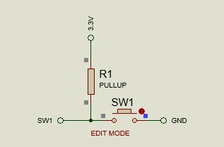
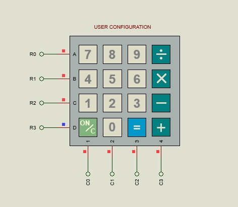
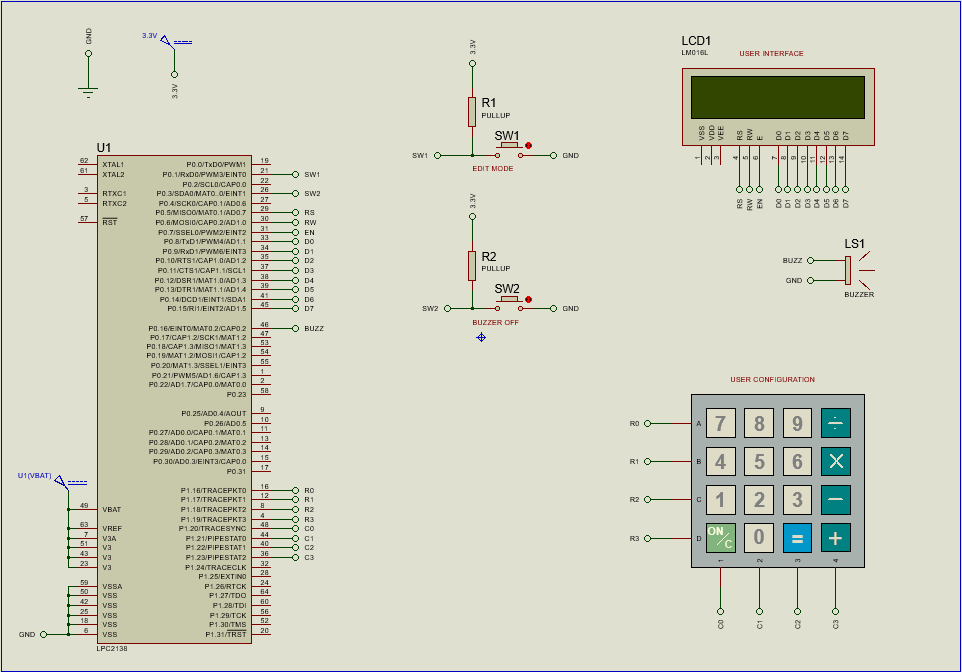

# 💊 USER CONFIGURABLE MEDICATION REMINDER SYSTEM  
### ⏰ Embedded System using LPC2148 (ARM7)

---

## ✨ Overview  

The **User Configurable Medication Reminder System** helps users take medicines on time using an embedded system.

It uses **RTC ⏰** to track time and alerts using **LCD 📟 + Buzzer 🔔**.  
Users can configure schedules using a **Keypad 🔢**.

---

## 🚀 Features  

✔️ Real-Time Clock Monitoring  
✔️ User Configurable Medicine Slots  
✔️ LCD Menu Interface  
✔️ Buzzer Alert System 🔔  
✔️ Next Medicine Prediction  
✔️ Interrupt-Based Control (EINT0 & EINT1)  
✔️ Simple UI  

---

## 🧩 Block Diagram  

<p align="center">

</p>

This diagram shows how all components are connected to the LPC2148 microcontroller.  
It illustrates the flow between keypad input, RTC processing, LCD output, and buzzer alert.

---

## 🔌 Circuit Diagram  

<p align="center">

</p>

The circuit diagram represents the real hardware connections used in Proteus simulation.  
It includes LPC2148, LCD, keypad, switches, and buzzer wiring details.

---

## ⚙️ Hardware Setup  

### 🔘 Switch 1 (Edit Mode)
<p align="center">

</p>

Switch1 is used to enter configuration or edit mode using external interrupt.  
It allows the user to modify RTC time and medicine schedules.

---

### 🔘 Switch 2 (Stop Alert)
<p align="center">

</p>

Switch2 is used to stop the buzzer alert during medicine reminders.  
It confirms that the user has taken the medicine.

---

## 🎮 Keypad Interface  

<p align="center">

</p>

The keypad is used for navigating menus and entering data.  
Users can set time, configure medicine slots, and control system options.

---

## 📟 LCD User Interface  

### 🟢 System Ready Screen
<p align="center">

</p>

This screen indicates that the system is powered on and ready.  
It shows the initial state before user interaction begins.

---

### ⏰ RTC Time Display
<p align="center">

</p>

Displays current time and date continuously from RTC.  
Acts as the main monitoring screen of the system.

---

## 📋 Menu Screens  

### ✏️ Edit Mode
<p align="center">

</p>

This menu allows the user to select RTC edit or medicine configuration.  
Navigation is done using keypad inputs.

---

### 🎮 Controls Info
<p align="center">

</p>

Displays instructions for keypad usage.  
Helps users understand navigation and control keys.

---

## 💊 Medicine Configuration  

### ➕ Add Medicine Slot
<p align="center">

</p>

Allows users to add a new medicine timing slot.  
User presses '=' key to confirm addition.

---

### ✅ Slot Added Successfully
<p align="center">

</p>

Confirms that the medicine slot has been saved.  
Provides feedback to the user after successful configuration.

---

## 🔔 Alert System  

### ⚠️ Medicine Reminder
<p align="center">

</p>

This alert is triggered when RTC matches a medicine schedule.  
The buzzer turns ON and user is prompted to take medicine.

---

### ⏭️ Next Medicine Display
<p align="center">

</p>

After taking medicine, the system shows the next schedule.  
Helps users prepare for upcoming medication.

---

## 🔄 System Workflow  

1. Initialize LCD, RTC, keypad, interrupts  
2. Display current time  
3. Enter Edit Mode using Switch1  
4. Configure medicine timings  
5. Monitor RTC continuously  
6. Trigger alert when time matches  
7. Stop alert using Switch2  
8. Display next medicine  

---

## 🧠 Working Principle  

- Switch1 → Enter setup mode  
- Keypad → Configure time & medicine  
- RTC → Provides real-time clock  
- Controller → Compares time  
- Match → Alert triggered 🔔  
- Switch2 → Stops alert  

---

## 🎮 Keypad Controls  

| Key | Function |
|-----|---------|
| 6 | Next Menu |
| 4 | Previous Menu |
| = | OK / Save |
| C | Exit |
| 5 | Instructions |

---

## 📁 Project Structure  

```
USER-CONFIGURABLE-MEDICATION-REMINDER-SYSTEM
│
├── src
├── include
├── images
├── proteus
└── README.md
```

---

## 🎯 Advantages  

✔️ Helps patients take medicine on time  
✔️ Easy to configure  
✔️ Useful for elderly care  
✔️ Low cost embedded system  
✔️ Real-time monitoring  

---

## 👨‍💻 Author  

**Mangena Balaji Sai Kumar**

---

## ⭐ Support  

If you like this project, give it a ⭐ on GitHub!
